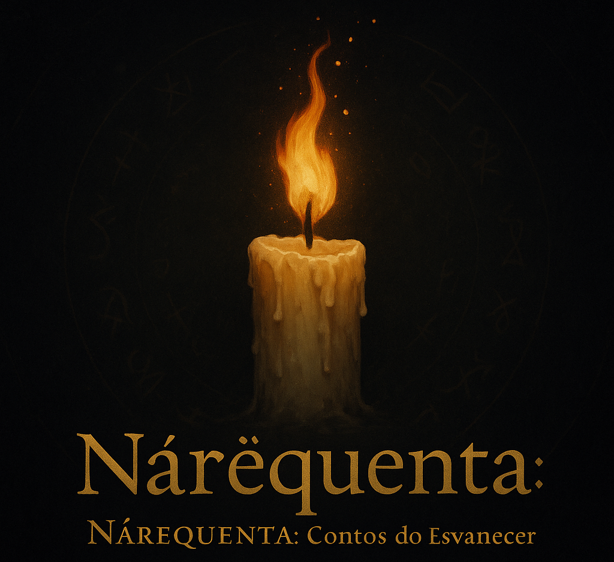

# Nárëquenta — Tales of the Waning

**Version: v0.7-FINAL (Precision Lethality)**
**Author:** Serelith Varn (cortonemo)
**License:** Nárëquenta Limited Open License (v0.1)

---

## 💡 Core Philosophy: Attrition is Meaning

Nárëquenta is a TTRPG about **Beautiful Erosion**. Heroes start near their absolute peak and gradually fade as they act and spend their Essence. Progression is not about number growth, but about **defining character through loss**.

**Axiom (v0.7):** Power is a finite resource. The real risk is not death, but the **Extinction of Essence**. **Proficiency Compensates for Decline**, allowing maximum impact with minimal capacity.

### Core Ideas

* You begin near **100%** in every Facet of self, following the **Initial Erosion ($1d10$)**.
* When you act, you **spend** from that Facet ($\mathbf{E_{cur}}$). The cost is slow and mitigated by proficiency.
* You may choose to **Refine** that Facet: permanently lower its maximum ($\mathbf{E_{max}}$), but gain **Proficiency Dice ($\mathbf{D_{prof}}$)** for efficiency and offensive power.
* Rest restores what remains of you, but never what you’ve already burned away.

## ⚙️ System Summary (v0.7)

The game is built around Essence management, **Tier-Neutral Damage**, and **Contested Rolls**.

- **E_max (Maximum):** Permanently decreased by the **Waning Roll** and subject to a **Hard Floor of 50%**. This reduction determines your **Proficiency Tier**.
- **E_cur (Current):** The usable energy. Defines the success threshold ($\mathbf{d100 \le E_{cur}}$).
- **Contested Rolls:** The Attacker uses $\mathbf{D_{prof}}$ (now unified $1d10$ per tier) for **Mitigation** and **Additive Damage**.
- **Damage:** Calculated via the **Additive Damage Formula** which prioritizes proficiency: $\mathbf{D_{Final}} = \max \left( 0, (A_{FP} - \bar{M}_{Defense} + D_{Margin} + R_{prof}) \right) \times M_{DTA}$.
- **Progress:** The decay risk grants $\mathbf{D_{prof}}$ and increasing **Action Surges (AS)** (up to 4 at Tier V).

## 🗂 Repository Contents

| Directory | Content | Status |
| :--- | :--- | :--- |
| **`/Rules/`** | The Core Mechanic, Metaphysics, and Rituals. | **v0.7 UPDATED** |
| **`/Playtest/`** | Sheets, scenarios, and quick references for the Alpha. | **v0.7 UPDATED** |
| **`/Logs/`** | Design notes and playtest feedback (dated). | **v0.1 DRAFT** |
| **`/Tools/`** | Calculation scripts and utilities (e.g., Nárëquenta Calculator in Python). | **NEW** |

---

### 📜 License & Authorship

**© 2025 Serelith Varn**
This project is released under the **Nárëquenta Limited Open License (v0.1)**.
You are free to play, stream, and create fan content for this system — as long as you provide proper credit and do not use it commercially.

📜 [Read the full license →](LICENSE.md)